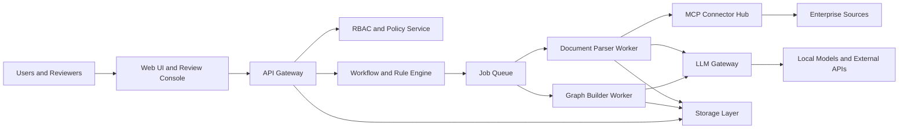

# Architecture

Enterprise Knowledge Hub is designed as a modular knowledge platform for enterprise document ingestion, retrieval augmented generation, knowledge graph construction, and governed AI workflows.

## Design Principles

- Keep source connectors, AI processing, storage, and review workflows separated by explicit service boundaries.
- Treat authorization and audit as mandatory platform concerns, not optional add-ons.
- Keep LLM access behind a gateway that centralizes routing, caching, retries, cost controls, and observability.
- Store raw documents, model files, vector snapshots, and runtime logs outside git.
- Design for local development first, then promote to production deployment through reproducible infrastructure.

## Target System Context



## Layers

### UI Layer

The UI provides search, graph exploration, ingestion status, audit review, and human approval workflows. The first implementation should favor a compact operational interface over a marketing-style landing page.

### Backend Layer

Backend services own API contracts, authentication, authorization, workflow state, audit records, and metadata. Services should be independently testable and should not directly embed LLM prompt logic.

### Orchestration Layer

The queue layer dispatches long-running ingestion and graph-building work. Jobs should carry correlation IDs, actor context, source document metadata, and policy decisions needed for audit.

### AI Processing Layer

Workers parse documents, split content into chunks, extract entities, build candidate relationships, and request LLM assistance through the LLM Gateway. Workers must not call external models directly unless routed through the gateway.

### MCP Connector Layer

MCP connectors expose controlled access to systems such as Confluence, internal databases, or document repositories. Connectors must enforce user context and least-privilege access.

### Storage Layer

Recommended storage responsibilities:

- PostgreSQL or SQL Server for metadata, workflow state, audit logs, and policy records.
- Qdrant for vector search.
- Neo4j, ArangoDB, or a relational graph model for entity relationships.
- Object storage or NAS for raw documents and model files.

## Processing Flow

1. Ingest request is created with user context and source metadata.
2. RBAC and source access checks run before any document read.
3. Rule Engine selects parsing strategy, model tier, review requirements, and priority.
4. Parser worker chunks content and extracts structured candidates.
5. Reducer merges duplicates and resolves conflicting candidates.
6. Human review or automated policy review approves, edits, or rejects results.
7. Verified content is committed to metadata storage, vector index, and graph storage.
8. Audit records capture actor, source, model, prompt category, result confidence, and storage IDs.

## Planned Monorepo Structure

```text
apps/
|-- web-console/                 # Search, graph, ingestion, and review UI

services/
|-- api-gateway/                 # API boundary and request orchestration
|-- auth-service/                # Identity, RBAC, and policy checks
|-- rule-engine/                 # Workflow routing and model selection
|-- llm-gateway/                 # Model routing, caching, retries, and telemetry

workers/
|-- document-parser/             # Parsing, chunking, OCR, and extraction
|-- graph-builder/               # Entity merge and relationship construction

mcp-servers/
|-- confluence-bridge/           # Controlled Confluence access
|-- internal-db-bridge/          # Controlled legacy database access

packages/
|-- shared-contracts/            # API schemas and shared types
|-- audit-client/                # Audit event helpers
|-- vector-client/               # Qdrant client wrapper

infrastructure/
|-- docker/                      # Local compose files
|-- migrations/                  # Database migrations and seed data
|-- observability/               # Metrics, dashboards, and alerts
```

Create these directories only when implementation begins. Until then, keep them out of git or preserve intentional placeholders with `.gitkeep`.

## Security and Compliance

- Every read from an enterprise source must be authorized with the requesting actor's context.
- Sensitive document processing must create immutable audit events.
- Prompt templates must avoid embedding secrets or private configuration.
- Logs must not include raw document content unless explicitly approved for a secure environment.
- Any public sample must use synthetic data.

## Deployment Notes

Local development can use Docker Compose. Production should use isolated networks, secret management, TLS, backup policy, and observability for all storage and queue components.

The existing `qdrant-multi-node-cluster/` directory is a demo for the vector database layer, not the full platform implementation.
