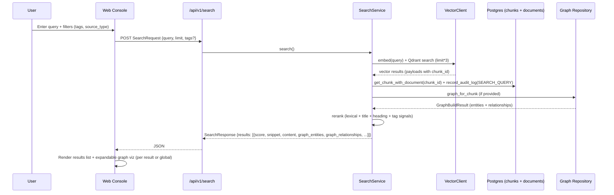

# Frontend Architecture and Implementation Plan

**Status:** Planning document only. No frontend code exists yet. See `architecture.md` (source-of-truth) for the UI Layer description and `apps/web-console/` placeholder in the planned monorepo structure. Per Experience Engine guidance and repository rules: do not claim runnable implementation until the corresponding code, contracts, and tests exist. Keep `docs/action.md` as strategic overview/roadmap.

This plan targets a compact operational web console for:
- Hybrid semantic + lexical search with snippets, metadata, and optional graph context (entities + relationships from approved chunks).
- Review queue (PENDING items from low-confidence ingestion; APPROVE / REJECT / MODIFY actions with mock `X-User-Role: Reviewer` header).
- Audit log viewer (INGEST_*, SEARCH_QUERY, ITEM_REVIEW events).
- Ingestion status and runs.
- Basic graph exploration (per-chunk or global build).

Backend (Phases 1-7 local MVP) is complete and verified:
- All offline tests: 169 passed, 4 skipped.
- Live (Docker PostgreSQL + Qdrant): test_live_integration_scaffold.py + test_live_graph_repository.py + audit/review paths pass (with documented Qdrant version mismatch warning).
- Phase 6 LLM Extraction Engine: LLMEntityExtractor, DomainTemplateRegistry, HyperedgeExtractor, EntityMerger, OllamaProvider, OpenAIProvider — wired to POST /api/v1/graph/build via LLM_ENABLED env flag.
- Phase 7: SQLAlchemy hyperedge persistence (migration 004), web-console wired (IngestionView, ReviewView real API, GraphCanvas force-directed).

## References
- `docs/architecture.md` — UI Layer, Processing Flow, Planned Monorepo (apps/web-console), Layers.
- `docs/phase-checklist.md` — Phase 1-5 verification + handoff notes.
- `AGENTS.md`, `.claude/rules/*`, `.rules` (Experience Engine) — must call engine before architecture/storage/audit/MCP/LLM or frontend integration changes.
- `packages/shared-contracts/nexus_shared/contracts.py` — Pydantic models for all API payloads (SearchRequest/Response, Review*, AuditRecord, Graph*, Ingestion*).
- `services/nexus-api/nexus_api/main.py` — Current routes: `/api/v1/search`, `/ingest`, `/review/queue`, `/review/action`, `/audit`, `/graph/build`, `/graph/chunks/{id}`, `/health`.
- `README.md` — Updated roadmap and verification commands (PowerShell-focused for this env).

## High-Level Architecture (Mermaid)

```mermaid
flowchart LR
    subgraph "Client / Browser"
        U[User / Reviewer]
        SPA[Web Console SPA<br/>React + TS + Vite]
    end

    subgraph "Backend (Current - Complete Local MVP)"
        API[FastAPI nexus-api<br/>/api/v1/*]
        SVC[Services: SearchService<br/>ReviewService<br/>GraphBuildService<br/>Audit]
        WORK[Workers: document-parser<br/>graph-builder]
        GW[llm-gateway (slice)]
        MCP[mcp-servers/confluence-bridge (scaffold)]
    end

    subgraph "Storage"
        PG[(PostgreSQL<br/>documents, chunks,<br/>audit_logs, review_items,<br/>graph_entities/relationships,<br/>ingestion_runs)]
        QD[(Qdrant<br/>nexus_chunks collection)]
    end

    U -->|Interactive UI| SPA
    SPA -->|Typed REST<br/>+ X-User-Role / X-User-Id headers| API
    API --> SVC
    SVC --> WORK
    SVC --> PG
    SVC --> QD
    WORK --> PG
    WORK --> QD
    GW -. optional for future conf -.-> WORK
    MCP -. future source ingest -.-> WORK
```

## Key UI Flows (Mermaid)

### Search + Graph Context Flow


### Review Queue + Action Flow (Phase 2)
```mermaid
flowchart TD
    Ing[IngestionPipeline low conf &lt; 0.70] -->|create_review_item| RI[(review_items PENDING)]
    RI --> RQ[GET /review/queue<br/>X-User-Role: Reviewer]
    RQ --> SPA[Review Console UI]
    SPA -->|Select item| Action[POST /review/action<br/>{item_id, action: APPROVE|REJECT|MODIFY, modified_content?, modified_payload?}]
    Action -->|require_reviewer| RS[ReviewService]
    RS -->|if APPROVE/MODIFY| Update[update_chunk_content + re-embed + vector upsert]
    RS -->|always| Audit[record_audit_log ITEM_REVIEW]
    Update --> QD[Qdrant point]
    RI -->|status change| PG
```

## Recommended Tech (Reference Only — Evaluate at Impl Time)
- Scaffold: Vite + React 18 + TypeScript + Tailwind.
- Data: TanStack Query (or fetch + SWR) with types derived from shared contracts (or OpenAPI codegen from FastAPI).
- Routing: React Router (search, review, audit, graph, ingest status).
- State: Lightweight (Zustand/Jotai) or React Query cache.
- Components: Results table/list with snippet highlight, filter chips, confidence badge, graph panel (react-force-graph or vis-network or Cytoscape.js for entities/rels), review action modal with diff/preview for MODIFY.
- Review RBAC: Simple header injector in dev (select role) + real JWT/OIDC later.
- Graph viz: Clickable nodes that filter search results or load per-chunk graph.
- Theming: Match existing dark aesthetic from index.html (or adopt design system).
- Build/Dev: Proxy to localhost:8000 during dev; env for API base.

**Do not create `apps/web-console/` directory until implementation begins** (per `architecture.md`). Use `.gitkeep` for the placeholder.

**ASCII-first design gate (2026-06-11 update):** 
Before any scaffold or code, complete and approve the design artifacts in `docs/ui.md` + `docs/UI/` (modeled on `docs/brainstorm-skill-package`).

**Implementation started (2026-06-11):** Scaffold + Phase A (Search with graph/document links) + Phase B start (Review Queue + actions) complete in apps/web-console/. Matches ASCII wireframes exactly. Use dev role switcher for mock RBAC. Run with backend for full flow (new LINKS_TO visible in search graph context).

- SKILL.md + _templates/ui-design.md define the process.
- `docs/UI/nexus-kb-operational-ui.md` contains the concrete design with multiple detailed ASCII wireframes (box-drawing), scenario matrices, UI state machines, exact wording, risks, and open questions.
- All primary screens (Search+Graph, Review Queue+Actions, Audit, etc.) have ASCII first.
- Only after ASCII + wording review/approval do we proceed to Phase A code.
- See `docs/ui.md` for the entry point.

## Phased Implementation Plan (High Level)

**Phase A: Scaffold + Core Search View (MVP UI)**
- Project init (Vite TS, Tailwind, router, query client).
- API client module (typed wrappers for SearchRequest/Response and common error shapes).
- Search page: query input, tag/source filters, results list (title, snippet, score, metadata, heading_path).
- Basic result detail: full content + tags/wikilinks + (optional) graph entities/relationships chips.
- Dev-only: header role switcher for future review.
- Verification: Storybook or simple e2e against running `uvicorn` + synthetic data; match existing search rerank behavior.

**Phase B: Review Console (Governance Surface)**
- Queue list (from GET /review/queue with min_confidence, pagination).
- Item detail + actions: Approve (direct), Reject (discard), Modify (edit content + payload tags/wikilinks; preview diff).
- Call POST /review/action; handle 403 (non-reviewer), 409 (already finalized).
- Optimistic UI + refetch on success; surface audit side-effect.
- Verification: Mirror `tests/test_review_flow.py` + `test_rbac_review.py` scenarios in UI tests (mock API or MSW).

**Phase C: Audit Viewer + Ingestion Status + Graph Explorer**
- Paginated audit log (GET /audit with filters).
- Ingestion runs history (reuse or extend /ingest response + new listing if added).
- Graph: Trigger POST /graph/build, view per-chunk graphs, simple force-directed or list view of entities/relationships with provenance (chunk_id links back to search).
- Verification: End-to-end with live backend (docker); synthetic audit/review/graph data only.

**Phase D: Polish, Integration, Safety**
- Error boundaries, loading skeletons, empty states.
- Responsive + keyboard (review actions).
- Export (audit CSV — redacted).
- Strict typing from contracts; correlation_id propagation where available.
- Performance: virtual lists for large result sets.
- Before real coding on any sub-phase: re-call Experience Engine `/api/intercept`; read architecture.md + phase-checklist + this plan + AGENTS.md.
- Create `apps/web-console/` + initial scaffold only when ready to commit real files.
- Add UI tests (vitest + testing-library or Playwright against test API).
- Update root README, index.html, and phase-checklist with links + evidence.

## Safety, Compliance, and Rules (Mandatory)
- All demo data: synthetic only (reuse existing fixtures/pipeline Note.md etc.).
- No raw document content in UI logs or persisted client state.
- Authorization: propagate actor context (headers for mock RBAC today; real later). Fail closed on review actions.
- Call the Experience Engine (`.rules`) before any architecture change, new storage access from UI, audit surface work, or MCP/LLM wiring.
- Repository source-of-truth precedence: AGENTS.md > architecture.md > this plan.
- When implementation starts: update PYTHONPATH/docs examples, add to CI if UI tests added, keep generated files out of git where appropriate.
- Frontend must not bypass review queue, audit emission, or graph provenance rules.

## Verification Checklist (Before Marking Any Sub-Phase Complete)
- Offline + live backend tests still green.
- UI can exercise: search (with rerank + graph context), low-conf review roundtrip (approve → vector appears), audit visible, graph build.
- Manual link/heading review on all touched docs (this file, README, index.html, architecture.md if extended).
- Experience Engine called for the work.
- No claims of "production ready" or "complete UI".

## Open Questions / Future
- Real auth (beyond mock X-User-Role headers).
- WebSocket or polling for long-running ingest/graph progress.
- Richer graph interactions (expand entity, path finding).
- Theming consistency with any future design system.
- Deployment (static hosting + API gateway).

Start only after re-reading the referenced docs and calling the Experience Engine for the specific sub-task. This plan is the blueprint; actual code lives in a future `apps/web-console/` when the time comes.

(Generated 2026-06-11 after full core verification.)
